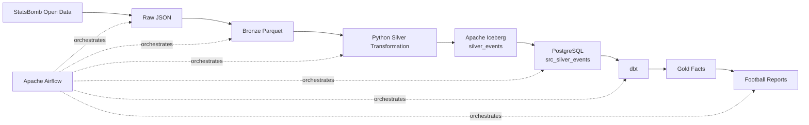

# Football Data Engineering Pipeline

[**README**](README.md) ·
[**Architecture**](docs/architecture.md) ·
[**Architecture Decisions**](docs/adr/README.md)

## Description

An end-to-end batch data engineering platform that ingests football event data from **StatsBomb Open Data**, transforms it into trusted analytical datasets, and generates automated match-level football reports.

The pipeline processes matches incrementally using **Apache Airflow**, persists canonical event data in **Apache Iceberg**, loads Silver data into **PostgreSQL**, and uses **dbt** to build tested analytical models for downstream reporting.

The project demonstrates production-oriented data engineering practices including:

- layered Raw, Bronze, Silver, and Gold data modeling;
- incremental and idempotent match processing;
- transactional loading and safe reprocessing;
- Apache Iceberg snapshots and table versioning;
- dimensional modeling with dbt;
- schema validation, data-quality testing, and reconciliation;
- pipeline and data observability;
- data lineage with OpenLineage;
- automated testing and CI with GitHub Actions.

**Core technologies:** Python · Apache Airflow · Apache Iceberg · PostgreSQL · dbt · DuckDB · Docker · GitHub Actions · OpenLineage

---

## Sample Reports

Each processed match produces a set of automated football analytics visualizations from the curated pipeline outputs.

### Expected Goals Timeline


Tracks cumulative expected goals (xG) throughout the match, showing how the quality and timing of chances changed as the game progressed.

---

### Expected Threat Momentum


Shows expected-threat (xT) generation over time, making changes in attacking momentum visible and highlighting periods when either team created greater territorial threat.

---

## High-Level Architecture



The primary data flow is:

```text
StatsBomb
   ↓
Raw JSON
   ↓
Bronze Parquet
   ↓
Canonical Silver Events
   ↓
Apache Iceberg
   ↓
PostgreSQL
   ↓
dbt Gold Models
   ↓
Football Reports
```

Airflow separates **match discovery** from **match processing**.

The discovery workflow identifies available work and dispatches one worker execution per match. Each match is then processed independently through ingestion, transformation, storage, analytical modeling, and report generation.

Canonical Silver events are stored in:

```text
football.silver_events
```

using Apache Iceberg.

The Silver rows required by downstream processing are loaded into PostgreSQL, where dbt builds analytical models including:

```text
fact_gold_team
fact_gold_intervals
```

For the full technical design, see the [Architecture Documentation](docs/architecture.md).

---

## Running Locally

### Prerequisites

Install:

- Git
- Docker
- Docker Compose

### 1. Clone the repository

```bash
git clone <repository-url>
cd <repository-name>
```

### 2. Configure the environment

Create a local environment file from the provided example:

```bash
cp .env.example .env
```

Update any required database credentials, paths, or service configuration for your environment.

### 3. Build and start the platform

```bash
docker compose up -d --build
```

Once the services are healthy, open the Airflow UI.

You can either:

- trigger the **discovery DAG** to discover and dispatch available matches; or
- trigger the **match worker DAG** directly for a specific `match_id`.

The worker pipeline executes:

```text
INGEST
  ↓
BRONZE
  ↓
SILVER / ICEBERG
  ↓
LOAD POSTGRES
  ↓
DBT BUILD
  ↓
REPORTS
```

### 4. Run Python tests

```bash
pytest -v
```

### 5. Run dbt manually

From the dbt project directory:

```bash
dbt debug
dbt build
```

### 6. Stop the platform

```bash
docker compose down
```

---

## Documentation

Detailed technical documentation is maintained separately so the README remains a concise entry point to the project.

| Document                                                | Description                                                                                                                                       |
| ------------------------------------------------------- | ------------------------------------------------------------------------------------------------------------------------------------------------- |
| [**Architecture**](docs/architecture.md)                | End-to-end system design, data flow, layer ownership, orchestration, reliability, data quality, observability, lineage, and deployment boundaries |
| [**Architecture Decision Records**](docs/adr/README.md) | Major engineering decisions, alternatives considered, trade-offs, and conditions under which those decisions should be revisited                  |

The documentation is organized around three levels:

```text
README
→ What is the project?

Architecture
→ How does the platform work?

ADRs
→ Why was it designed that way?
```

---

## License

Football event data used by this project is sourced from **StatsBomb Open Data**.

Use of the data remains subject to StatsBomb's applicable attribution and usage terms.

The source code for this project is licensed according to the terms defined in the repository's [`LICENSE`](LICENSE) file.
