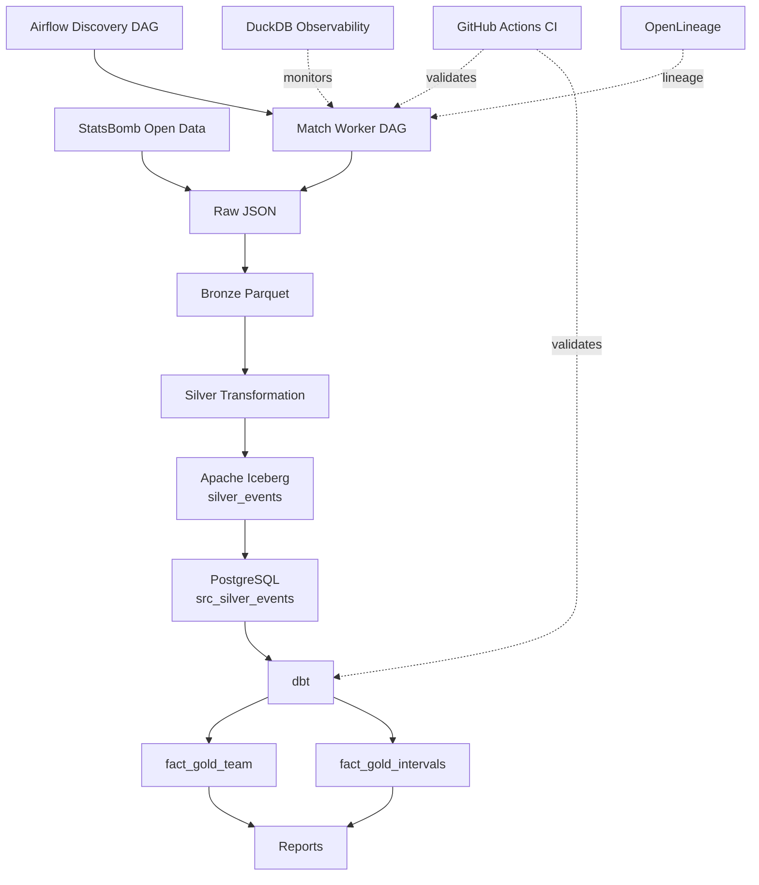

# Football Data Engineering Pipeline

An end-to-end batch data platform for ingesting football event data, transforming it into analytical models, validating data quality, and producing football-specific analytical reports.

The project uses **Apache Airflow, Apache Iceberg, PostgreSQL, dbt, Python, DuckDB, Docker, and GitHub Actions** to demonstrate production-oriented data engineering patterns including incremental processing, idempotency, data quality, reconciliation, dimensional modeling, table versioning, observability, and lineage.

The pipeline culminates in football-specific analytical reports including **xT heatmaps, passing networks, shot maps, and match momentum visualizations**.

---

## Architecture



### Layer responsibilities

| Layer                       | Responsibility                                                     |
| --------------------------- | ------------------------------------------------------------------ |
| **Raw**                     | Preserve source payload with metadata and hash-based idempotency   |
| **Bronze**                  | Convert provider JSON into tabular event structure                 |
| **Silver**                  | Canonical football event model with validation and derived metrics |
| **Iceberg Silver Table**    | Versioned, snapshot-based storage of Silver data                   |
| **PostgreSQL Source Layer** | SQL-accessible serving layer for dbt                               |
| **dbt Gold**                | Analytical models with tests and contracts                         |
| **Reports**                 | Football visualizations and match-level insights                   |

---

## Pipeline Design

The pipeline separates **work discovery** from **work execution**.

### Discovery DAG

- Fetch available matches
- Identify unprocessed matches
- Trigger one worker DAG per match

### Match Worker DAG

Each match is processed independently:

```text
INGEST
  ↓
BRONZE
  ↓
SILVER
  ↓
ICEBERG COMMIT
  ↓
POSTGRES LOAD
  ↓
DBT BUILD
  ↓
REPORTS
```

This ensures isolation, retryability, and bounded failure impact.

---

## Data Layers

### Raw

Immutable ingestion layer storing original payloads with metadata:

- match_id
- source URL
- ingestion timestamp
- SHA-256 hash

Idempotency is enforced via hash comparison.

---

### Bronze

Light transformation layer:

- JSON → tabular structure
- minimal semantic changes
- Parquet storage

Separates parsing from domain logic.

---

### Silver

Canonical football event model:

- normalized pitch coordinates (105×68)
- validated schema
- derived metrics (xG, xT, progressive actions)
- duplicate handling
- domain rules enforcement

This layer is implemented in Python due to its domain complexity.

---

## Apache Iceberg

Silver data is stored in an **Iceberg table**:

```text
football.silver_events
```

Iceberg provides:

- snapshot isolation
- schema evolution
- partition evolution
- time travel
- atomic commits

Each match write produces a new snapshot, ensuring reproducibility and safe reprocessing.

---

## PostgreSQL Serving Layer

Iceberg Silver data is loaded into:

```text
serving.src_silver_events
```

using transactional replacement:

- delete match rows
- insert fresh data

This ensures dbt always reads a consistent match state.

---

## dbt Analytical Models

dbt defines the Gold layer:

### `fact_gold_team`

Grain:

```text
one row = team × match
```

Metrics:

- xG
- shots
- passes
- xT contribution

---

### `fact_gold_intervals`

Grain:

```text
team × match × time interval
```

Used for temporal analysis of momentum and xT flow.

---

dbt responsibilities:

- SQL transformations
- model dependencies
- incremental builds
- data contracts
- tests (generic + custom)
- reconciliation with Silver

---

## Data Quality Strategy

### Schema validation

Ensures structural correctness.

### Semantic validation

Ensures football logic correctness:

- xG bounds
- valid event types
- non-null constraints

### Cross-layer reconciliation

Ensures no data loss between layers:

- Silver vs Gold comparisons
- xG / xT consistency checks

### Database constraints

PostgreSQL enforces:

- primary keys
- foreign keys
- check constraints

---

## Idempotency Model

Idempotency is enforced at multiple levels:

- **Raw** → hash-based deduplication
- **Airflow** → deterministic match execution
- **Iceberg** → snapshot versioning
- **PostgreSQL** → transactional replacement
- **dbt** → incremental model keys

This allows safe reprocessing of any match.

---

## Failure Handling

Failures are classified as:

- **Transient** → retryable (network, infra)
- **Deterministic** → data issues (schema, validation)

Airflow enforces:

- retries
- timeouts
- bounded concurrency
- failure callbacks

---

## Observability

DuckDB-based observability layer tracks:

- task success/failure rates
- execution duration
- retry patterns
- row volume changes
- anomaly detection

Key models:

- `stage_health`
- `volume_history`
- `alert_candidates`
- `current_health`

This forms a lightweight data observability system.

---

## Lineage

OpenLineage captures pipeline lineage:

- Jobs
- Runs
- Input datasets
- Output datasets

Example flow:

```text
Bronze → Silver → Iceberg → PostgreSQL → dbt → Reports
```

Lineage is visualized via Marquez.

---

## CI Pipeline

### Python tests

```bash
pytest
```

### Airflow validation

- DAG import checks
- dependency validation

### dbt tests

```bash
dbt build
```

Runs against isolated PostgreSQL with fixture data.

---

## Technology Stack

| Area             | Technology                     |
| ---------------- | ------------------------------ |
| Orchestration    | Apache Airflow                 |
| Ingestion        | Python                         |
| Transformation   | Python / dbt                   |
| Storage          | Parquet / Iceberg              |
| Serving          | PostgreSQL                     |
| Analytics        | dbt                            |
| Observability    | DuckDB                         |
| Reporting        | Python (mplsoccer, matplotlib) |
| CI               | GitHub Actions                 |
| Lineage          | OpenLineage                    |
| Containerization | Docker                         |

---

## 📊 Match Analytics Reports 

### xG Timeline 

 

Expected goals progression over time, showing attacking intensity and chance quality evolution. 

--- 

### xT Momentum 

 

Field progression-based momentum model capturing territorial dominance and attacking flow.

---

### 🧠 Interpretation Layer

Reports are generated via:

```text
dbt Gold models
    ↓
aggregations (team / interval)
    ↓
Python visualization layer
    ↓
static report artifacts
```

Each match becomes a self-contained analytical story.

---

### 📁 Output Structure

```text
reports/
├── match_{id}/
│   ├── xt_heatmap.png
│   ├── passing_network.png
│   ├── shot_map.png
│   └── momentum.png
```

---

## Key Engineering Decisions

### Match-level processing

Enables isolation, retryability, and backfills.

### Python for Silver, dbt for Gold

Separates domain logic from analytical modeling.

### Iceberg for Silver storage

Provides snapshot-based reproducibility.

### PostgreSQL as dbt source

Ensures stable SQL execution layer.

### Dimensional modeling

Optimized for football analytics queries.

---

## What This Project Demonstrates

- production-grade data pipeline design
- layered architecture (Raw → Bronze → Silver → Gold)
- idempotent processing
- snapshot-based data versioning
- data quality engineering
- orchestration with Airflow
- analytical modeling with dbt
- observability and monitoring
- lineage tracking
- football-specific analytics generation

---

## Scope Boundaries

This project intentionally excludes:

- streaming systems (Kafka)
- CDC pipelines
- distributed compute (Spark)
- Kubernetes deployment
- real-time inference systems

Focus is on **batch analytics and reproducible football intelligence pipelines**.

---

## Project Status

✅ Fully functional end-to-end pipeline
✅ Automated CI validation
✅ Observability layer implemented
✅ Lineage tracking enabled
✅ Football analytics reports generated

---

## License

Uses StatsBomb Open Data. Refer to their licensing terms for data usage.
