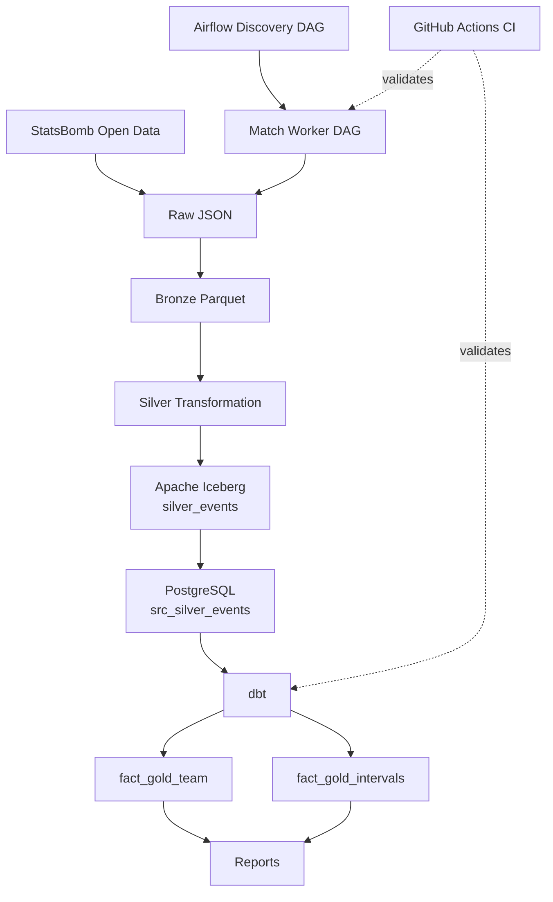

## 📚 Table of Contents

* [Architecture](#architecture)
* [Pipeline Design](#pipeline-design)
* [Data Layers](#data-layers)
* [Apache Iceberg](#apache-iceberg)
* [PostgreSQL Serving Layer](#postgresql-serving-layer)
* [dbt Analytical Models](#dbt-analytical-models)
* [Data Quality Strategy](#data-quality-strategy)
* [Idempotency Model](#idempotency-model)
* [Failure Handling](#failure-handling)
* [Observability](#observability)
* [Lineage](#lineage)
* [CI Pipeline](#ci-pipeline)
* [Match Analytics Reports](#match-analytics-reports)
* [Key Engineering Decisions](#key-engineering-decisions)
* [License](#license)

---

## Architecture



---

## Pipeline Design

The pipeline separates **discovery** from **execution**.

### Discovery DAG

* Fetch available matches
* Identify unprocessed matches
* Trigger per-match worker DAGs dynamically

### Worker DAG (per match)

```text
INGEST → BRONZE → SILVER → ICEBERG COMMIT → POSTGRES LOAD → DBT → REPORTS
```

Each match is an isolated unit of computation.

---

## Data Layers

### Raw

Immutable ingestion layer with metadata + source hash.

### Bronze

Light transformation from nested JSON → tabular structure.

### Silver

Canonical football event model:

* normalized pitch coordinates
* validated schema
* derived metrics (xT, progressive actions)
* deduplication

---

## Apache Iceberg

Silver is stored as:

```
football.silver_events
```

Iceberg provides:

* snapshot isolation
* schema evolution
* time travel
* atomic commits

This ensures reproducibility across reprocessing runs.

---

## PostgreSQL Serving Layer

Iceberg Silver snapshot is loaded into:

```
serving.src_silver_events
```

Design choice:

* transactional replacement per match
* safe reprocessing
* dbt-compatible relational layer

---

## dbt Analytical Models

### fact_gold_team

Grain:

```
team × match
```

### fact_gold_intervals

Grain:

```
team × match × time interval
```

Responsibilities:

* metric aggregation
* business logic
* testing
* documentation
* incremental builds

---

## Data Quality Strategy

### 1. Schema validation

* required columns
* type enforcement

### 2. Semantic validation

* xG bounds
* uniqueness constraints
* null checks

### 3. Cross-layer reconciliation

* Silver vs Gold consistency checks
* metric preservation validation

### 4. Database constraints

* PK / FK / CHECK constraints in PostgreSQL

---

## Idempotency Model

Idempotency is enforced at multiple layers:

### Source

* SHA-256 hash prevents duplicate ingestion

### Airflow

* deterministic per-match execution

### Iceberg

* snapshot-based versioning

### PostgreSQL

* transactional overwrite per match

### dbt

* incremental models with stable keys

---

## Failure Handling

Failures are classified as:

### Transient

* retries allowed
* network / infra issues

### Deterministic

* schema violations
* data quality failures
* no retry

Airflow controls:

* retries
* timeouts
* bounded concurrency
* failure callbacks

---

## Observability

DuckDB-based observability layer:

* stage health tracking
* volume monitoring
* retry analysis
* anomaly detection
* pipeline health scoring

Progression:

```
telemetry → metrics → baselines → anomalies → health signals
```

---

## Lineage

OpenLineage integration:

Tracks:

* Jobs
* Runs
* Input datasets
* Output datasets

Used for:

* pipeline traceability
* dependency visualization
* debugging execution flows

---

## CI Pipeline

### Python

```
pytest
```

### Airflow

* DAG import validation
* dependency checks

### dbt

* `dbt build` on isolated Postgres
* tests + contracts + models

Ensures full pipeline correctness before merge.

---

## Match Analytics Reports

Generated outputs include:

* team performance summaries
* xG analysis
* xT flow analysis
* interval-based momentum charts

These are produced from Gold models.

---

## Key Engineering Decisions

### 1. Match-level processing grain

Enables isolation, retries, and scalability.

### 2. Python for Silver, dbt for Gold

Separates:

* domain logic (Python)
* analytical logic (SQL)

### 3. Iceberg for Silver storage

Provides:

* versioning
* reproducibility
* schema evolution

### 4. PostgreSQL as dbt bridge

Simplifies SQL execution layer.

### 5. Dimensional modeling

Optimized for analytical queries over football data.

---

## License

Uses StatsBomb Open Data.
Refer to their licensing terms for usage constraints.
