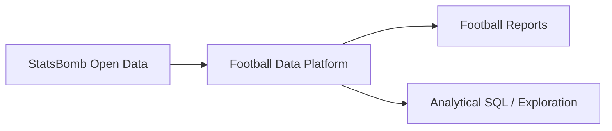
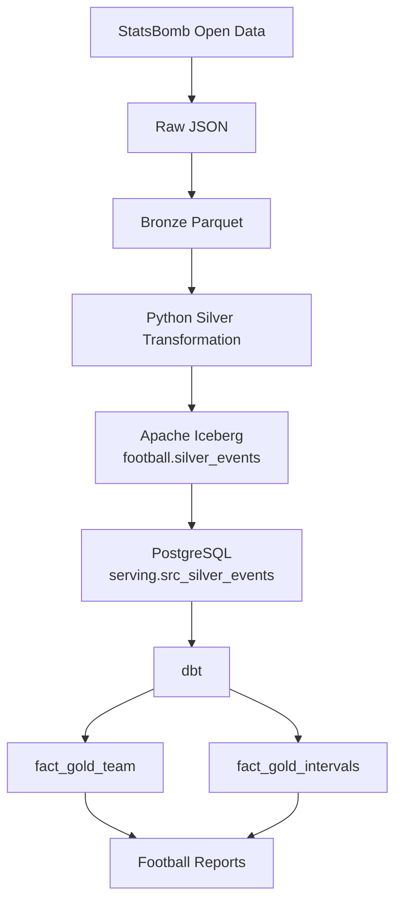
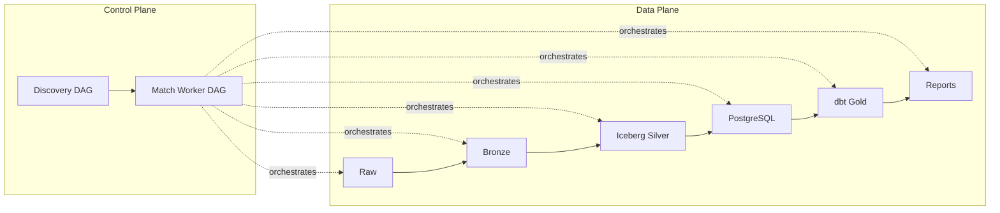
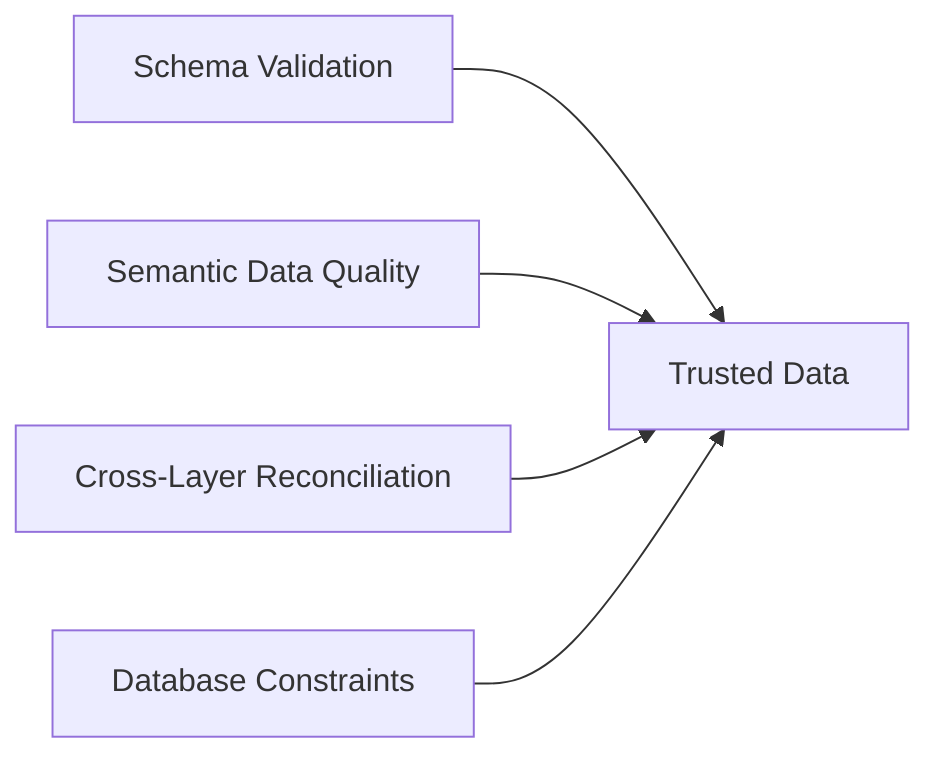
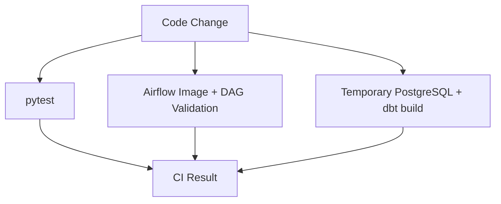

# Football Data Platform — Architecture

[**README**](../README.md) ·
[**Architecture**](../architecture.md) ·
[**Architecture Decisions**](README.md)

## 1. Purpose

This document describes the final technical architecture of the Football Data Engineering Pipeline.

The platform ingests football event data from StatsBomb Open Data, transforms it into a canonical event model, persists versioned Silver data using Apache Iceberg, builds analytical models with dbt, and produces match-level football reports.

The architecture is designed around several engineering principles:

- incremental processing;
- idempotent reprocessing;
- explicit data grain;
- immutable source preservation;
- reproducible downstream processing;
- separation of orchestration and transformation responsibilities;
- layered data quality;
- observable pipeline and data health;
- explicit lineage and metadata boundaries.

The system is intentionally batch-oriented and optimized for the current football-data workload rather than designed as a generic distributed platform.

---

# 2. System Context

At the highest level, the platform converts externally published football event data into trusted analytical datasets and reports.



StatsBomb is the external source.

The Football Data Platform owns ingestion, transformation, storage, data quality, orchestration, analytical modeling, and report generation.

---

# 3. High-Level Architecture



The primary data flow is:

```text
StatsBomb
   ↓
Raw
   ↓
Bronze
   ↓
Silver
   ↓
Iceberg
   ↓
PostgreSQL
   ↓
dbt Gold
   ↓
Reports
```

---

# 4. Control Plane and Data Plane

The platform separates the **control plane** from the **data plane**.

## Control Plane

The control plane determines:

- what should run;
- when it should run;
- which match should be processed;
- task dependencies;
- retries;
- concurrency;
- failure handling.

Apache Airflow owns these responsibilities.

## Data Plane

The data plane contains the actual football datasets and transformations:

```text
Raw
→ Bronze
→ Silver
→ Gold
→ Reports
```

This distinction prevents orchestration state from being confused with the data itself.



---

# 5. Orchestration Architecture

Two primary workflow responsibilities are separated.

## Discovery / Controller DAG

The discovery workflow operates at competition or season scope.

Its responsibilities include:

1. retrieving currently available matches;
2. updating match metadata;
3. determining which matches require processing;
4. dispatching one worker execution for each required match.

It does not perform full match transformation itself.

Conceptually:

```text
Discover matches
      ↓
Update match metadata
      ↓
Identify required work
      ↓
Match 101 ─┐
Match 102 ─┼→ Worker DAG executions
Match 103 ─┘
```

## Match Worker DAG

The worker operates at the atomic processing grain:

```text
one workflow execution = one match
```

Its logical sequence is:

```text
INGEST
   ↓
BRONZE
   ↓
SILVER
   ↓
COMMIT ICEBERG
   ↓
LOAD POSTGRES
   ↓
DBT BUILD
   ↓
REPORTS
```

This architecture allows match failures, retries, backfills, and reprocessing to remain isolated.

---

# 6. Processing Grain

The primary operational work key is:

```text
match_id
```

A match represents the smallest meaningful independent processing unit.

This gives the pipeline:

- failure isolation;
- selective retry;
- independent reprocessing;
- controlled parallelism;
- simple backfill semantics.

Processing grain must not be confused with analytical or storage grain.

```text
Processing grain
→ one Airflow worker execution per match

Silver analytical grain
→ one row per football event

Gold team grain
→ one row per team × match

Gold interval grain
→ one row per team × match × period × interval

Physical partitioning
→ storage optimization decision
```

These concerns are deliberately independent.

---

# 7. Raw Layer

## Responsibility

Raw preserves the original source representation for fidelity and traceability.

Raw data is treated as immutable.

The ingestion process records metadata including:

```text
match_id
source/provider
source URL
ingestion timestamp
file hash
source version/path
```

SHA-256 hashing provides source-level duplicate detection.

Conceptually:

```text
same match + same hash
→ duplicate source

same match + different hash
→ revised source version
```

The Raw layer therefore provides the recovery boundary if downstream datasets must be rebuilt.

---

# 8. Ingestion Manifest

The ingestion manifest belongs to the control/metadata side of ingestion rather than the analytical data model.

Its responsibilities include tracking:

- which source artifacts have been received;
- file hashes;
- duplicate detection;
- source revision information;
- source locations;
- ingestion status.

The manifest remains after Iceberg adoption because Iceberg and the ingestion manifest solve different problems.

```text
Ingestion Manifest
→ source lifecycle

Iceberg Metadata
→ Silver table lifecycle
```

---

# 9. Bronze Layer

Bronze converts raw nested source JSON into a tabular representation while retaining the provider's structure and semantics.

Its primary purpose is to separate:

```text
source parsing
```

from:

```text
canonical domain transformation
```

Bronze remains persisted as Parquet.

It is intentionally not an Iceberg table because the project does not currently require Bronze-level:

- table history;
- shared cross-match querying;
- schema evolution management;
- partition evolution.

---

# 10. Silver Layer

Silver is the canonical football event model.

Its grain is:

```text
one row = one football event
```

Python owns the Silver transformation.

Typical responsibilities include:

- source normalization;
- type normalization;
- coordinate normalization to a 105 × 68 pitch;
- duplicate handling;
- progressive-pass calculation;
- expected-threat calculations;
- event-level schema validation;
- football-specific business logic.

Silver acts as the boundary between provider-shaped data and the canonical domain representation.

---

# 11. Apache Iceberg Silver Storage

The canonical Silver dataset is persisted as:

```text
football.silver_events
```

using Apache Iceberg.

Parquet remains the physical file format underneath the table.

Iceberg adds table-level functionality including:

```text
snapshots
manifests
schema metadata
partition metadata
time travel
table-state history
```

## Snapshot Pinning

Each successful Silver commit produces an Iceberg snapshot identifier.

Downstream tasks receive:

```text
match_id
snapshot_id
```

and read the exact committed table version associated with that workflow execution.

```text
Silver transformation
      ↓
Iceberg commit
      ↓
snapshot_id = X
      ↓
Postgres load
      ↓
read snapshot X
```

This prevents a downstream task from accidentally reading a newer table state created by another concurrent or later pipeline execution.

## Reprocessing

Reprocessing a match creates another committed table state.

```text
Snapshot A
---------
Match 101 v1
Match 102

        ↓ reprocess

Snapshot B
---------
Match 101 v2
Match 102
```

Historical snapshots remain available until retention or maintenance removes them.

---

# 12. PostgreSQL Layer

The current dbt environment uses `dbt-postgres`.

Silver is therefore exposed to dbt through:

```text
serving.src_silver_events
```

The source table is populated from the exact Iceberg snapshot associated with the worker execution.

## Load Semantics

Silver uses match-level replacement:

```sql
BEGIN;

DELETE FROM serving.src_silver_events
WHERE match_id = :match_id;

INSERT INTO serving.src_silver_events (...);

COMMIT;
```

This provides:

```text
idempotency
+
atomicity
```

A retry does not append duplicate match data, and consumers do not observe a partially replaced match.

## Ownership

The authoritative Silver representation remains Iceberg.

```text
Iceberg
→ canonical Silver

PostgreSQL src_silver_events
→ SQL-accessible projection
```

PostgreSQL can therefore be rebuilt from Iceberg if required.

---

# 13. dbt Transformation Layer

dbt owns analytical transformation after the PostgreSQL Silver source boundary.

Conceptually:

```text
serving.src_silver_events
          ↓
        staging
          ↓
        Gold
```

Primary Gold facts are:

```text
fact_gold_team
fact_gold_intervals
```

dbt owns:

- SQL analytical transformations;
- dependency management through `source()` and `ref()`;
- incremental processing;
- contracts;
- generic tests;
- singular tests;
- reconciliation;
- documentation;
- model lineage.

Python does not maintain duplicate Gold implementations.

---

# 14. Analytical Data Model

## fact_gold_team

Grain:

```text
one row = one team × one match
```

Typical measures include:

```text
goals
shots
xG
passes
progressive passes
positive xT
negative xT
net xT
```

This fact supports cross-match and season-level analysis.

## fact_gold_intervals

Grain:

```text
one row =
one team × one match × period × interval
```

This supports time-based analysis such as xT momentum.

## Match Metadata

Match descriptive information provides context such as:

```text
date
competition
season
home team
away team
```

This allows analytical queries such as:

```text
xG by opponent
performance by venue
shots by match
xT through time
```

---

# 15. Data Quality Architecture

Correctness is enforced through several independent mechanisms.



## Schema Validation

Answers:

> Is the structure correct?

Examples include:

```text
required columns
expected types
unexpected columns
```

## Semantic Data Quality

Answers:

> Are the values themselves valid?

Examples include:

```text
accepted values
non-null requirements
identifier uniqueness
valid football metric ranges
```

## Cross-Layer Reconciliation

Answers:

> Did transformation lose or invent information?

Examples include:

```text
Silver shots ≈ Gold shots

Silver xG ≈ Gold xG

positive_xT + negative_xT ≈ net_xT
```

## Database Constraints

PostgreSQL additionally refuses structurally invalid database state through:

```text
PRIMARY KEY
FOREIGN KEY
NOT NULL
CHECK
```

These mechanisms are complementary rather than interchangeable.

---

# 16. Idempotency Model

Idempotency appears at several architectural levels.

```text
Source
→ hash-based duplicate detection

Airflow
→ deterministic work identity / controlled reruns

Iceberg
→ committed table states and match replacement

PostgreSQL
→ transactional match replacement

dbt
→ incremental models with stable unique keys
```

The same principle is implemented differently depending on the system boundary.

---

# 17. Failure and Retry Model

Failures are divided conceptually into:

```text
transient
vs
deterministic
```

Examples of transient failures:

```text
network interruption
temporary source failure
database connection issue
```

These may benefit from retry and backoff.

Examples of deterministic failures:

```text
invalid schema
failed reconciliation
broken business invariant
invalid SQL/model logic
```

Retrying these with the same input would not change the result.

They therefore fail without unnecessary repeated execution.

---

# 18. Concurrency Model

Match workflows can execute independently.

Concurrency is bounded only where a shared resource requires protection.

Examples include:

```text
StatsBomb API
→ API pool

dbt/PostgreSQL writes
→ bounded write concurrency
```

The design principle is:

> A concurrency limit should protect a known constrained resource rather than being introduced arbitrarily.

---

# 19. Observability Architecture

The project distinguishes operational health from data health.

## Operational Observability

Answers:

> Is the pipeline machinery working?

Current structured metadata captures:

```text
task attempts
status
duration
row counts
retries
timestamps
```

DuckDB exposes observability views including:

```text
observability.stage_health
observability.stage_volume_history
observability.recent_stage_health
observability.retry_summary
```

## Data Observability

Answers:

> Is the produced data healthy?

Current mechanisms include:

```text
dbt tests
model contracts
reconciliation
volume baselines
volume anomaly detection
```

DuckDB models include:

```text
observability.silver_volume_monitor
observability.silver_volume_health
observability.alert_candidates
observability.current_health
```

The project therefore implements the progression:

```text
telemetry
   ↓
metrics
   ↓
baseline
   ↓
anomaly
   ↓
health
   ↓
alert candidate
```

At production scale, operational telemetry could move to a Prometheus/Grafana-style monitoring stack and data observability to dedicated tooling.

---

# 20. Lineage

The platform explored standardized lineage through OpenLineage.

The core model is:

```text
Input Dataset
      ↓
     Job
      ↓
Output Dataset
```

For example:

```text
Bronze
   ↓
Silver transformation
   ↓
Iceberg silver_events
```

Airflow automatically emits job/run metadata through the OpenLineage provider.

Where arbitrary Python transformations prevent automatic dataset discovery, explicit input/output lineage can supplement the emitted event.

Marquez was used locally to demonstrate the lineage graph but is not treated as a required production dependency.

---

# 21. Metadata and Catalog Boundaries

The platform contains several forms of metadata.

```text
Ingestion manifest
→ source provenance

Iceberg catalog
→ Iceberg table location/state

dbt metadata
→ model descriptions, tests and dependencies

OpenLineage
→ job/dataset lineage

DuckDB observability
→ execution and health metadata
```

These should not be confused with a full enterprise data catalog.

A future multi-domain platform could introduce tooling such as DataHub or OpenMetadata for centralized:

```text
discovery
ownership
business metadata
lineage
quality metadata
governance
```

The current project does not have enough data assets or organizational complexity to justify that infrastructure.

---

# 22. Reporting

Reports are downstream consumers of curated data rather than transformation owners.

The reports consume dbt-owned Gold models for analytical metrics.

Event-level visualizations may use canonical Silver data where the event grain is required.

The reporting layer does not independently redefine Gold analytical metrics.

This preserves:

```text
one metric
→ one authoritative implementation
```

---

# 23. CI Architecture

GitHub Actions validates multiple independent system boundaries.



## Python CI

Validates source/domain transformation functions.

```bash
pytest
```

## Airflow CI

Builds the custom Airflow Docker image and validates DAG imports.

This detects failures such as:

```text
missing dependency
invalid imports
broken DAG definition
environment packaging mismatch
```

## dbt CI

Creates an isolated PostgreSQL service and deterministic fixture data before executing:

```bash
dbt build
```

This validates:

```text
SQL execution
dependencies
contracts
generic tests
business-rule tests
reconciliation
```

The CI database is ephemeral and independent from the development database.

---

# 24. Deployment Model

The project runs locally using Docker Compose.

Containerization provides reproducible dependencies for:

```text
Airflow
PostgreSQL
Python libraries
dbt
Iceberg integration
```

Docker Compose is intentionally treated as a local development/deployment mechanism.

The architecture does not assume that Docker Compose would be the production deployment model.

A production Airflow installation could instead use managed or Kubernetes-based infrastructure without changing the fundamental data-layer boundaries documented here.

---

# 25. Technology Responsibilities

| Technology     | Primary Responsibility                                  |
| -------------- | ------------------------------------------------------- |
| Python         | Source ingestion and domain transformation              |
| pandas         | Local tabular transformation                            |
| Requests       | Source HTTP ingestion                                   |
| Parquet        | Physical columnar file representation                   |
| Apache Iceberg | Canonical Silver table management                       |
| PyIceberg      | Python Iceberg table operations                         |
| PostgreSQL     | Relational source bridge and analytical serving         |
| dbt            | Analytical transformation, testing and documentation    |
| Apache Airflow | Workflow orchestration                                  |
| DuckDB         | Lightweight observability and local analytical querying |
| pytest         | Python transformation testing                           |
| GitHub Actions | Continuous integration                                  |
| OpenLineage    | Standardized job/dataset lineage                        |
| Docker Compose | Local runtime environment                               |

---

# 26. Deliberate Architectural Boundaries

Several technologies were deliberately not introduced.

## No Kafka

The source is batch-oriented and largely immutable.

Simulating streaming would not create realistic CDC, event-time, or late-data problems.

## No Spark

The current data volume does not require distributed computation.

Introducing Spark would add infrastructure without solving a scaling constraint.

## No Kubernetes

The project focuses on data-platform architecture rather than production cluster operations.

## No Full Data Catalog

The number of assets and users does not justify running enterprise metadata infrastructure locally.

## No Additional Observability Platform

The core concepts have already been demonstrated through structured Airflow metadata, DuckDB, dbt tests, and OpenLineage.

These boundaries prevent the project from becoming tool-driven.

---

# 27. Known Trade-Offs

The architecture intentionally accepts several compromises.

### Iceberg → PostgreSQL Duplication

Canonical Silver exists in Iceberg and is copied into PostgreSQL for `dbt-postgres`.

This avoids introducing another query engine but duplicates storage and creates another pipeline stage.

### Local Transformation Compute

Some Python transformation still executes within the Airflow environment.

At larger scale, Airflow would normally submit this work to a dedicated compute engine.

### Custom Lightweight Observability

JSONL metadata and DuckDB are appropriate for the project scale but would be replaced by dedicated telemetry infrastructure in a larger production platform.

### Batch-Only Source

The source does not expose realistic CDC, late-arrival, or event-time challenges.

Those topics are intentionally deferred to a separate project built around mutable transactional data.

---

# 28. Architecture Evolution

The architecture evolved from:

```text
API
 ↓
Python
 ↓
Parquet
 ↓
Reports
```

into explicit responsibilities:

```text
Source lifecycle
      ↓
Raw / manifest
      ↓
Canonicalization
      ↓
Bronze / Silver
      ↓
Versioned table management
      ↓
Iceberg
      ↓
Relational analytical boundary
      ↓
PostgreSQL
      ↓
Analytical transformation
      ↓
dbt
      ↓
Reports
```

Standard tools were adopted only after the underlying problem became visible.

Where a standard tool replaced custom functionality, the old implementation was removed rather than maintained as a second source of truth.

---

# 29. Related ADRs

Detailed rationale for major architectural decisions is maintained separately:

```text
ADR-001
Use One Match as the Atomic Processing Grain

ADR-002
Use Dimensional Modeling for the Gold Analytical Layer

ADR-003
Use Python for Silver and dbt for Gold

ADR-004
Use Apache Iceberg for Canonical Silver Storage

ADR-005
Use PostgreSQL as the Serving and dbt Bridge Layer

ADR-006
Separate Operational Observability,
Data Observability, Lineage, and Metadata Concerns
```

This document describes **what the final architecture is**.

The ADRs document **why it became that architecture**.

---

# 30. Final Architecture Summary

```text
                     CONTROL PLANE
                   ┌───────────────┐
                   │    Airflow    │
                   │               │
                   │ Discovery DAG │
                   │ Worker DAG    │
                   └───────┬───────┘
                           │
                           ▼

                      DATA PLANE

 StatsBomb
     │
     ▼
 Raw JSON
     │
     ▼
 Bronze Parquet
     │
     ▼
 Python Silver
     │
     ▼
 Apache Iceberg
 silver_events
     │
     ▼
 PostgreSQL
 src_silver_events
     │
     ▼
 dbt
 ┌───────────────┐
 │               │
 ▼               ▼
fact_gold_team  fact_gold_intervals
 │               │
 └───────┬───────┘
         ▼
      Reports


              CROSS-CUTTING CONCERNS

 Quality
 → schema validation
 → semantic DQ
 → reconciliation
 → database constraints

 Reliability
 → hashing
 → idempotency
 → transactions
 → retries
 → snapshot pinning
 → bounded concurrency

 Observability
 → Airflow execution metadata
 → DuckDB health models
 → volume anomaly detection

 Lineage
 → Airflow + OpenLineage

 Engineering
 → Docker
 → pytest
 → GitHub Actions CI
```

The resulting architecture is intentionally small enough to run locally while demonstrating the engineering principles required for a larger production data platform.
